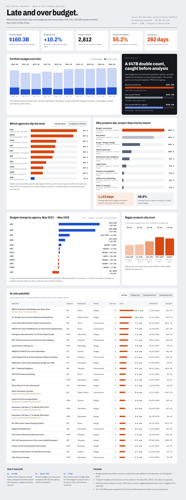

# Late and Over Budget: Delays and Cost Overruns in NYC Capital Projects

An end-to-end data analysis of New York City's **$160B capital infrastructure portfolio**, tracking how project budgets and completion dates changed across 10 reporting snapshots from **May 2023 to May 2026**.

**Tools:** Python (pandas) · MySQL · SQL (CTEs, window functions, views) · Google Colab · Interactive dashboard (designed with Claude Design)



📄 Full dashboard: [`dashboard/`](dashboard/)

---

## The problem

NYC funds thousands of capital projects (bridges, water infrastructure, police and fire facilities, parks), and many of them finish later than planned. Acting as an analyst for a capital program oversight team, this project answers five questions:

1. How has the total capital budget changed over three years?
2. Which agencies' budgets grew the most?
3. Which agencies' projects slip the most, and by how much?
4. **Why** do projects slip?
5. Which active projects are most at risk right now?

## Key findings

| | Finding |
|---|---|
| 📈 | **55.2% of tracked projects slipped**, by an average of **282 days** (about 9 months). |
| 💰 | The portfolio grew **10.2%**, from $145.5B to $160.3B, but dipped to $127.5B in January 2024 before recovering. |
| 🏛️ | **Design & Construction (+$9.1B) and Environmental Protection (+$8.1B)** account for most of the budget growth. |
| 🚨 | **Homeless Services, NYPD and FDNY projects slip the most**: 97.5%, 88.9% and 83.3% of their projects slipped, by an average of 974, 897 and 539 days. |
| 🌳 | **Parks runs the most projects (1,092) yet slips the least**: only 20.5% slipped more than six months. |
| ⏳ | **Budget constraints cause the longest delays, averaging 1,133 days each**, about four times longer than any other common reason. |
| ❓ | **40.9% of delays have no reason recorded**, a reporting gap that limits root-cause analysis. |
| 📏 | **Bigger projects slip more**: about 41% of projects under $10M slipped over six months, rising to 70% for $50–100M projects. |

## The data trap: a $47B double count

The most important step in this project happened before any analysis.

The source data repeats a budget line's full amount on **every project it funds**. A $50M budget line linked to four projects appears four times. Summing the raw table looks correct but isn't:

| Method | May 2026 total | Error |
|---|---|---|
| Naive sum of all rows | $207.59B | **+$47.25B (29% overstated)** |
| One row per FMS ID | $159.71B | −$0.63B (drops budgets split between agencies) |
| **One row per FMS ID + agency** ✅ | **$160.34B** | Correct |

I found the correct level of detail (grain) by testing candidate keys in Python: only **reporting period + FMS ID + managing agency** gave 100% consistent budgets within each group. The SQL model is built around that grain, and the $160.34B total matches exactly in both Python and SQL.

## Approach

### 1. Data profiling and cleaning (Python)
[`notebooks/01_data_profiling.ipynb`](notebooks/01_data_profiling.ipynb) · [`notebooks/02_data_cleaning.ipynb`](notebooks/02_data_cleaning.ipynb)

- Profiled three datasets totaling **132,484 rows**
- Converted all text date columns to real dates and flagged out-of-range values
- Collapsed **~60 inconsistent phase labels** (`(On-Hold)`, `On hold`, `CONSTRUCTION`, …) into 8 clean phase groups
- Grouped 13 raw delay reasons into categories, merging near-duplicates
- Ran grain tests to find the correct budget key (see above)
- Logged every cleaning step to [`data_quality_log.csv`](data/processed/data_quality_log.csv)

### 2. Data modeling (MySQL)
[`sql/`](sql/)

| Script | What it does |
|---|---|
| `01_create_database.sql` | Creates the database |
| `02_load_staging.sql` | Loads the cleaned CSVs and validates row counts and totals against Python |
| `03_build_star_schema.sql` | Builds the star schema, including a **bridge table** for the many-to-many link between budget lines and projects |
| `04_analysis.sql` | Analysis views and queries using **CTEs, `FIRST_VALUE`, `ROW_NUMBER`, `SUM() OVER`** and conditional aggregation |
| `05_powerbi_views.sql` | Dashboard-ready views with size bands and data-quality flags |

**Data model**

| Table | Grain (one row per…) |
|---|---|
| `fact_budget_snapshot` | reporting period + FMS ID + agency |
| `fact_project_snapshot` | reporting period + project |
| `fact_schedule_change` | change to a project's forecast completion date |
| `bridge_fms_project` | budget line + project link |
| `dim_project`, `dim_agency` | project, agency |

Shared budget lines are split evenly across the projects they fund, so no dollar is counted twice when analyzing budgets at project level.

### 3. Dashboard
A single-page dashboard covering KPIs, the budget trend, agency slippage, delay reasons, budget change by agency, project size versus slippage, and an at-risk watchlist of 25 active projects.

## Caveats

- **Budget growth ≠ overrun.** A growing budget can reflect cost overruns or deliberate scope additions; the data doesn't distinguish them.
- **"Original" means earliest in the data.** Baselines are the May 2023 snapshot, not values at project approval.
- **Possible placeholder dates.** Several projects slipped *exactly* 1,826 days (5 years), suggesting placeholder forecasts. These are flagged in the watchlist.
- **Minor conflicts.** 26 of 26,598 project snapshots (0.1%) had conflicting forecast dates across funding lines.
- **One table set aside.** The monthly budget history table couldn't be reliably deduplicated (no line-item identifier), so all budget analysis uses the snapshot table, where the grain is verified.

## Next steps

- Investigate whether the Department of Correction's −70% budget change is a transfer of projects to another agency rather than a real cut
- Check the January 2024 portfolio dip against NYC budget announcements from that period
- Build a model to predict which active projects will slip more than six months

## Repository structure

```
nyc-capital-projects-analysis/
├── data/processed/      Cleaned CSVs and data-quality log
├── notebooks/           Python profiling and cleaning
├── sql/                 MySQL scripts, run in order 01 → 05
├── dashboard/           Dashboard (PDF)
├── images/              Dashboard screenshot
└── README.md
```

## How to reproduce

1. Download the three source datasets (links below) into `data/raw/`.
2. Run `notebooks/02_data_cleaning.ipynb`, which writes cleaned files to `data/processed/`.
3. Copy the files from `data/processed/for_mysql/` into MySQL's `secure_file_priv` folder.
4. Run the SQL scripts in order, `01` → `05`. Each script ends with validation checks.

## Data source

NYC Open Data, **Capital Projects Dashboard**:
- [Citywide Budget and Schedule](https://data.cityofnewyork.us/d/fb86-vt7u)
- [Citywide Schedule History and Variance](https://data.cityofnewyork.us/d/95tx-snak)
- [Citywide Budget Spend History and Variance](https://data.cityofnewyork.us/d/qj5n-h5qp)

---

**Shivam Singh**
